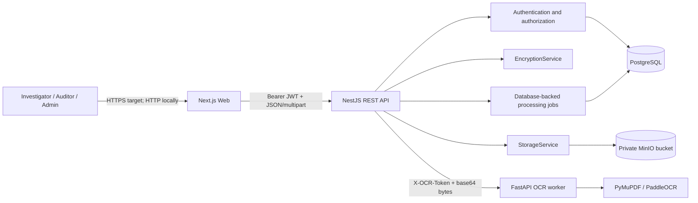
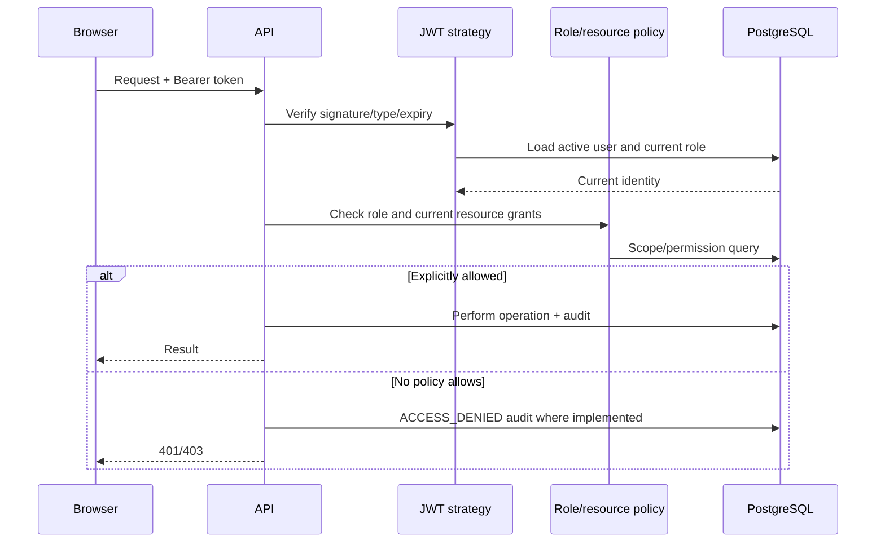
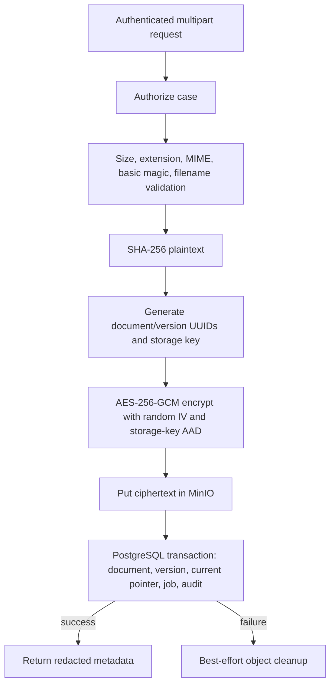
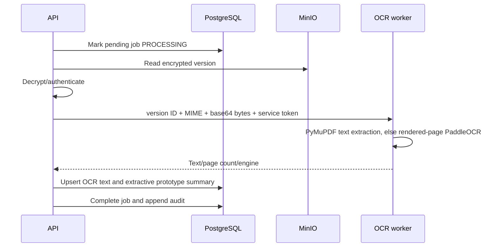

# Architecture

**As verified:** 29 August 2026

## System context

SIH 26190 is a modular NestJS document-management monolith with a Next.js web
client and an independently deployed OCR process. PostgreSQL is authoritative
for identity, authorization, document metadata, fixity records, audit events and
derived text. MinIO is authoritative for encrypted file objects.

## Containers and processes

| Component | Implementation | Responsibility | Current boundary |
| --- | --- | --- | --- |
| Web | Next.js 16/React/TypeScript | UI, session bootstrap, API calls | Browser-visible; token in `sessionStorage` |
| API | NestJS/TypeScript | Security policy, orchestration, Swagger | Primary security boundary |
| Database | PostgreSQL 17 + Prisma | Metadata and current authorization state | Local Compose; localhost port after recreation |
| Object storage | MinIO | Encrypted object bytes | Private bucket; localhost port after recreation |
| OCR | FastAPI/Python | Text extraction/OCR only | Token-authenticated, non-root, localhost port |

The OCR worker is not trusted to make user authorization decisions. The API
authorizes a document/version before supplying bytes and stores the result.

## Module boundaries

- `AuthModule`: password verification, JWT issuance and current-user loading.
- `UsersModule` / `DepartmentsModule`: administrative reference data.
- `CasesModule`: case scope and case membership.
- `DocumentsModule`: resource authorization, ingestion, versions, grants,
  retrieval, fixity, search and processing orchestration.
- `EncryptionModule`: AES-256-GCM envelope operations.
- `StorageModule`: MinIO implementation behind `StorageService`.
- `AuditModule`: serialized hash-linked audit-event creation.
- `services/ocr`: extraction/parser boundary independent of the API process.

## Request lifecycle

Unknown permission conditions deny by default. Frontend button visibility is
not an authorization boundary.

## Authentication lifecycle

1. Login normalizes email and loads the user, role and department.
2. bcrypt compares the submitted password with `passwordHash`.
3. Inactive users and invalid credentials are rejected and audited.
4. JWT contains only subject and token type; permission grants are not embedded.
5. Every protected request verifies JWT expiry/signature and reloads the active
   user/role, so deactivation and role changes affect subsequent requests.

Limitations: no MFA/federated identity, refresh token, explicit token revocation,
or production cookie session. Browser tokens in `sessionStorage` increase the
impact of an XSS defect.

## Authorization lifecycle

The current model is RBAC plus case membership/department scope plus active
user/department document grants. `DocumentAuthorizationService` centralizes
document permission checks. Creators and ADMIN currently bypass document grants;
AUDITOR receives VIEW only. The administrative-content bypass requires
separation-of-duties review in Phase 2.

The least-privilege capability rules are:

- VIEW may be satisfied by a stronger document capability because metadata must
  be visible to exercise it.
- DOWNLOAD requires an explicit DOWNLOAD grant (or current creator/admin bypass).
- EDIT, SHARE and APPROVE require their matching capability.
- REVOKED rows never satisfy a query.

## Upload lifecycle

The current validation stage is not quarantine or malware inspection. PDF
validation checks only the header and DOCX validation checks only ZIP magic.

## Retrieval and integrity lifecycle

1. Authorize VIEW for preview or DOWNLOAD for export.
2. Resolve the requested version only within the authorized document.
3. Load the encrypted object through `StorageService`.
4. Decrypt and authenticate AES-GCM using the storage key as AAD.
5. SHA-256 the decrypted bytes and compare the version record.
6. On mismatch/decryption failure, return controlled conflict and audit failure.
7. Otherwise stream with private/no-store/nosniff headers and audit the action.

No public or presigned object URL is returned. API version DTOs explicitly omit
the internal storage key.

## Versioning lifecycle

New content creates a new row and unique object key. The transaction calculates
`max(versionNumber)+1`; a compound unique constraint detects concurrent clashes
and the API asks the caller to retry. The current-version pointer changes; prior
rows/objects are not edited by normal APIs. This is application-level append-only
versioning, not storage-enforced WORM.

## OCR lifecycle

Worker/parsing failure marks the job FAILED; it does not alter the source object.
The job model is synchronous and database-backed, without locks, leases,
backoff, durable independent consumption or dead-letter behavior.

## Search lifecycle

The API builds a database predicate containing both the authenticated scope and
the title/case/all-version OCR query. PostgreSQL returns only permitted rows;
the frontend does not filter a global result set. When historical OCR matches,
the newest matching version and contextual snippet are returned. Search is
`contains`-based rather than a true PostgreSQL full-text index and is capped at
100 documents.

## Audit lifecycle

An advisory transaction lock serializes append operations. Each event hashes its
stable input, timestamp and the previous event hash. There is no mutation API.
However, no verifier, database append-only role/trigger, remote archive, digital
signature or WORM storage exists. The chain is therefore a useful linkage
mechanism but not independently protected or legally sufficient chain of custody.

## Failure paths

| Failure | Current behavior | Gap |
| --- | --- | --- |
| PostgreSQL transaction fails after MinIO put | Best-effort object delete | No orphan reconciler/lifecycle proof |
| MinIO object missing/corrupt | Controlled retrieval/integrity failure | No repair workflow |
| OCR unavailable/fails | Source stays available; job fails | Retry/lease/backoff model is weak |
| Duplicate process request | May create another pending job after completion | No idempotency key |
| Concurrent version number | Unique constraint returns 409 and cleanup | No automatic retry |
| Audit write fails in document transaction | Transaction fails | Some non-transactional actions depend on separate audit transaction |

## Trust and storage boundaries

1. Browser input becomes untrusted at the API DTO/multipart boundary.
2. JWT identity is trusted only after cryptographic verification and current DB
   user lookup.
3. Resource identifiers remain untrusted until authorization queries succeed.
4. MinIO content remains untrusted until GCM authentication and SHA-256 match.
5. OCR output is derived/untrusted text and must render inertly.
6. API-to-worker requests are authenticated but not encrypted independently on
   local HTTP; production requires private networking and TLS/mTLS as appropriate.
7. PostgreSQL/MinIO administrators are privileged actors outside current
   application-level immutability guarantees.

## Current limitations

- No malware scanner, quarantine, content disarm, or rich format validation.
- No KMS/HSM, envelope keys, rotation, or tested key recovery.
- No protected independent audit archive or audit-chain verifier.
- No legal hold, retention/disposition or explicit custody/provenance model.
- No MFA/federated identity or break-glass flow.
- No real PostgreSQL/MinIO testcontainers suite.
- OCR PDF/scanned corpus is not yet demonstrated end to end.
- No tested backup/restore or production deployment architecture.
