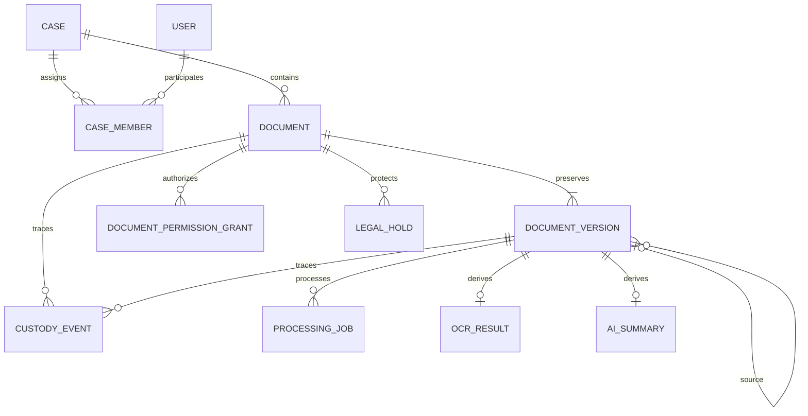

# Data model

## Security constraints

- Storage key is unique; `(document_id, version_number)` is unique.
- Exactly one user/department principal is required per grant.
- Partial unique indexes prevent duplicate ACTIVE principal/capability grants.
- A partial unique index permits at most one ACTIVE legal hold per document.
- Integer revisions on documents, grants and holds support conditional updates; stale mutations affect zero rows and return `409 Conflict`.
- Parent/source version and custody/legal-hold foreign keys restrict deletion.
- Current document version is a unique foreign key.
- Audit event hashes are unique.

PostgreSQL contains sensitive metadata, OCR text, summaries, grants, custody and audit history and requires protection equivalent to the source system. No physical document/version deletion API exists. `DISPOSED` is a logical marker only; older cascade rules must be reviewed before any future purge endpoint.
