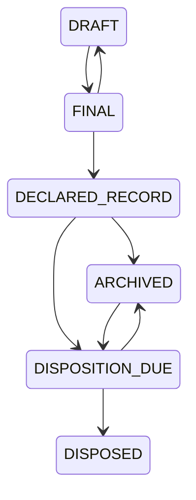

# Records lifecycle

**Status:** Implemented prototype lifecycle; not an official government retention schedule.

Processing status and record status are separate. OCR may fail while a document remains an authoritative record.

Every transition requires `APPROVE`, a reason, an allowed transition, the latest document revision, an audit event and a custody event. The revision is updated atomically; a stale decision returns `409 Conflict` rather than overwriting newer state. `DISPOSED` is currently a logical terminal status only: the prototype does not delete PostgreSQL metadata or MinIO bytes. Physical purge, retention calculation and approval workflows are not implemented.

## Legal hold

A legal hold records case, document, reason, optional reference, placer and release metadata. A PostgreSQL partial unique index permits only one active hold per document, including under concurrent requests. Placement and release conditionally update the document revision, and release also checks the hold revision. While active, transition to `DISPOSED` returns 409, the status/source remain unchanged, and the denial is recorded in audit and custody history. Releasing a hold requires `APPROVE` and a reason.

Storage-level retention lock and legally validated retention policy are not implemented.

## Processing lifecycle

Processing jobs retain independent `QUEUED`, `RUNNING`, `SUCCEEDED`, `RETRY_PENDING`, `FAILED` and `DEAD` states. Atomic claims, attempt limits, exponential retry metadata and reclaimable 60-second leases are implemented. Processing is still request-triggered; autonomous dispatch, lease heartbeat and cross-system reconciliation remain Phase 3 work.
