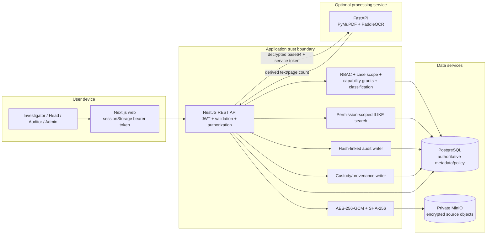
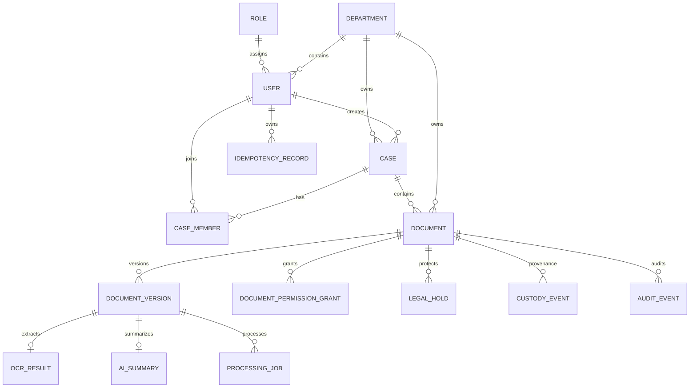
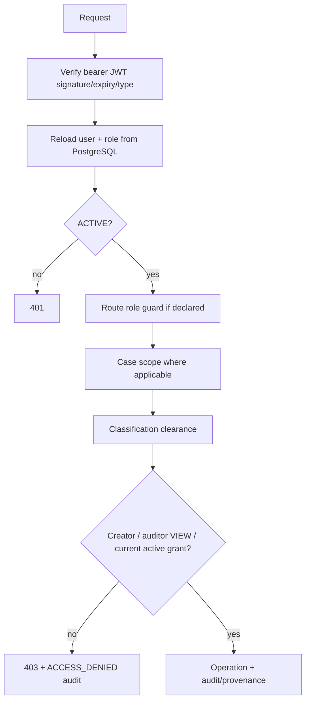
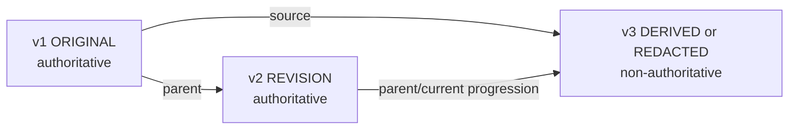
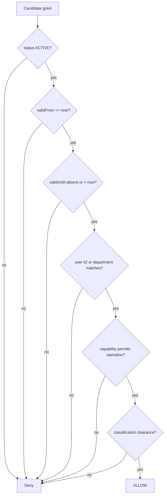
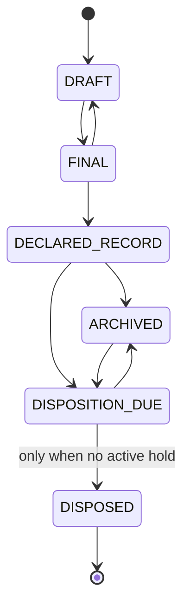

# G-Vaults Current Implementation Deep Audit

**Project:** SIH 2026 Problem Statement 26190 — Secure Digital Document Management System for Legal and Investigation Documents  
**Audit date:** 24 September 2026  
**Audit basis:** repository inspection plus commands listed in section 32  
**Scope:** the checked-out working tree, including uncommitted Phase 2/3 files shown by `git status`  
**Status vocabulary:** **VERIFIED** = implementation plus executed runtime/test evidence; **IMPLEMENTED** = code/schema exists but this audit did not execute a decisive end-to-end proof; **PARTIAL** = useful implementation with a material missing part; **EXPERIMENTAL** = prototype behavior unsuitable for an authoritative claim; **NOT IMPLEMENTED**, **DEFERRED**, or **CANNOT VERIFY** are literal.

> This report describes the working tree as inspected, not necessarily the latest Git commit. Documentation was treated as a claim source, never as proof.

## 1. Executive Summary

G-Vaults is a functioning **hardened hackathon MVP**, not a production-ready government records platform. Its strongest demonstrated path is the secure document workflow: authenticated user → permission-scoped case/document operation → validated upload → SHA-256 fixity → AES-256-GCM encryption → private MinIO object → PostgreSQL metadata/version/job/audit/provenance → permission-scoped retrieval and search.

The audit executed **36 automated tests across 7 test files**: 31 API regression tests in 4 Jest suites, one real PostgreSQL/MinIO integration journey in 1 Jest suite, and four Chromium tests in 2 Playwright files. All passed. Lint and all three workspace production builds passed. The isolated database applied all **9 migrations** successfully.

The current implementation contains **15 Prisma models, 14 enums, 30 application API endpoints, 7 frontend page routes, 5 roles, 5 document capabilities, 4 classifications, 6 record states, 4 version kinds, 12 custody event types, and 11 controlled document types**.

The principal qualifications are important:

- OCR/PDF extraction code exists, but the real integration suite deliberately runs without the OCR service and the browser journey uses text files. Real PaddleOCR/PDF behavior is therefore **PARTIAL / NOT AUTOMATICALLY VERIFIED**.
- “AI summary” is a deterministic first-600-character extract, not an LLM summary.
- Search uses Prisma case-insensitive `contains` (PostgreSQL `ILIKE` behavior), not PostgreSQL full-text search, embeddings, or semantic search.
- Audit events are SHA-256 hash-linked and serialized by a PostgreSQL advisory transaction lock. This is tamper-evident application logging, not immutable/WORM storage.
- Versions are preserved by application behavior and absent delete/update-byte APIs; MinIO Object Lock/WORM is not configured.
- Legal hold blocks the logical `DISPOSED` transition. There is no file/document deletion endpoint, retention scheduler, or physical disposition workflow.
- The job model has leases/retries/idempotency, but processing is invoked synchronously through the API; there is no autonomous worker dispatcher or durable external queue.
- No malware scanner, quarantine, CDR, MFA, federated identity, KMS/HSM, SIEM, backup/restore proof, HA/DR, digital signature, or government-system integration is implemented.

## 2. Repository Structure

| Area | Responsibility | Evidence |
|---|---|---|
| `apps/api` | NestJS REST API, Prisma, auth/authz, cases, documents, records, storage, cryptography, audit, OCR client | `apps/api/src`, `apps/api/prisma` |
| `apps/web` | Next.js App Router user interface and Playwright journeys | `apps/web/src/app`, `apps/web/tests` |
| `services/ocr` | Optional FastAPI/PyMuPDF/PaddleOCR processing service | `services/ocr/app`, `services/ocr/Dockerfile` |
| `packages/shared` | Shared TypeScript role/domain types | `packages/shared/src/index.ts` |
| `docs` | Architecture, security, lifecycle and phase reports; supporting evidence only | `docs/` |
| root Compose | Local PostgreSQL, private MinIO, optional OCR profile | `docker-compose.yml` |
| integration Compose | Disposable PostgreSQL/MinIO on alternate ports and tmpfs | `docker-compose.integration.yml` |

Workspace dependency flow:

```text
Browser → @sih/web → HTTP bearer API → @sih/api
                                      ├─ Prisma → PostgreSQL
                                      ├─ StorageService → MinIO
                                      └─ OcrClientService → FastAPI OCR (optional)
@sih/web and @sih/api → @sih/shared
```

There are **2 applications**, **1 independent service**, and **1 shared package**. No CI workflow, Kubernetes manifest, production reverse proxy, Terraform, Helm, or cloud deployment manifest was found.

Resolved key versions at audit time include Node workspace requirements `>=20`, NestJS 11.2.3, Prisma Client 6.19.3, Next.js 16.3.3, React 19.2.8, TanStack Query 5.102.5, Playwright 1.62.1, TypeScript 5.9.3, MinIO client 8.0.7, Helmet 8.3.0, and bcryptjs 3.0.3. `npm ls` also reported an extraneous `@img/sharp-wasm32@0.35.4` package; this did not fail build/test.

## 3. Current Architecture

### 3.1 Implemented architecture

The Next.js client stores a bearer token in `sessionStorage`, validates it using `/auth/me`, and calls the NestJS API. NestJS validates all DTOs globally, authenticates JWTs, reloads the active user and current role from PostgreSQL for every authenticated request, and applies role/resource checks. PostgreSQL is authoritative for identities, memberships, grants, versions, lifecycle state, OCR-derived data, audit data, and provenance. Original source bytes are never stored in PostgreSQL: encrypted envelopes are stored in a private MinIO bucket. The optional OCR worker receives decrypted bytes as base64 from the API over its internal HTTP endpoint.



### 3.2 Authority and plaintext boundaries

- **Permissions:** PostgreSQL current state is authoritative; grants are not embedded in JWTs.
- **Source bytes:** encrypted objects live in MinIO; object keys and hashes live in PostgreSQL.
- **Plaintext:** exists in API memory during upload/decrypt/response and in OCR worker memory during processing; PDF raster pages are in memory. No temporary filesystem path is accepted from a client.
- **Derived text/summary:** `ocr_results` and `ai_summaries` in PostgreSQL.
- **Authorization:** Nest guards handle authentication/role metadata; `CasesService` and `DocumentAuthorizationService` enforce resource policy.
- **Trust caveat:** API-to-OCR uses a shared header token but local plain HTTP by default. Transport encryption/service identity is a production gap.

## 4. Implementation Matrix

| # | Subsystem | Status | Implemented evidence and material limitation |
|---:|---|---|---|
| 1 | Authentication | VERIFIED | Login, `/auth/me`, wrong/missing/invalid/expired/inactive cases tested. |
| 2 | Password handling | VERIFIED | bcrypt hashes; cost 12 in seed/user creation. Integration fixtures use cost 4 only for test speed. |
| 3 | JWT/token handling | VERIFIED | Bearer JWT, default 8h, expiry enforced, 32-character minimum secret; no refresh/revocation/logout server state. |
| 4 | User identity loading | VERIFIED | Current DB user/role loaded on each request; inactive user rejected. |
| 5 | Roles | VERIFIED | Five seeded role codes and guarded endpoints. |
| 6 | Department scope | VERIFIED | Case creation restricted to own department except admin; department grants supported. |
| 7 | Case membership | VERIFIED | Explicit `CaseMember`; investigator access test passes. No membership-management API/UI. |
| 8 | Case authorization | VERIFIED | Admin/auditor all cases, head own department, others explicit membership. Existing unauthorized UUID yields 403. |
| 9 | Document authorization | VERIFIED | Central capability/current-grant/classification check; known UUID denial tested. |
| 10 | Resource capabilities | VERIFIED | VIEW, DOWNLOAD, EDIT, SHARE, APPROVE; VIEW implication and DOWNLOAD separation tested. |
| 11 | Admin separation of duties | VERIFIED | Admin has case administration visibility but no automatic document-content access; API test passes. |
| 12 | Auditor permissions | IMPLEMENTED | Auditor gets classification-limited document VIEW only; dedicated end-to-end auditor matrix not executed. |
| 13 | Classification | IMPLEMENTED | Four-level prototype clearance map and DB/search/document filtering; taxonomy is not an official government classification scheme. |
| 14 | Case management | VERIFIED | List/create/detail, unique case number, owner membership, audit. No update/archive UI/API. |
| 15 | Document upload | VERIFIED | Multipart upload, case/classification authorization, encryption, MinIO, transactional metadata, job, audit/provenance, cleanup attempt. |
| 16 | File validation | VERIFIED | Size, extension, MIME, selected magic bytes, text validity and sanitized filename tested; no malware/CDR and DOCX ZIP check is shallow. |
| 17 | Encryption | VERIFIED | AES-256-GCM envelope, random 12-byte nonce, 16-byte tag, storage-key AAD; real MinIO test proves plaintext absent. |
| 18 | Hashing/fixity | VERIFIED | SHA-256 over source plaintext per version; tampered-object mismatch tested. Not a signature. |
| 19 | Object storage | VERIFIED | Storage abstraction/private MinIO, generated keys, no public URL; real integration exercised put/get/delete. |
| 20 | Document preview | VERIFIED | Authenticated inline content endpoint with integrity check, no-store and nosniff. |
| 21 | Download | VERIFIED | Separate DOWNLOAD capability, authenticated attachment response, audit; VIEW-only denial tested. |
| 22 | Versioning | VERIFIED | v2 preserves/downloads v1, unique version number and storage key, conflict handling. Application-level append-only only. |
| 23 | Version semantics | PARTIAL | Four kinds stored. v1 is ORIGINAL, derived/redacted require source; later `ORIGINAL` is not explicitly prohibited. |
| 24 | Parent/source lineage | VERIFIED | Parent/current source references stored; derived source constrained to same document; history UI/API exists. |
| 25 | Provenance/custody | VERIFIED | Separate structured events and browser/API proof. Technical provenance, not legal certification. |
| 26 | Audit logging | VERIFIED | 22 observed code-defined action names, hash links, advisory lock, success/denied/failure records. No chain verifier/WORM. |
| 27 | Access grants | VERIFIED | User or department principal, five capabilities, reason and timing fields, exact-one-principal DB check. |
| 28 | Expiry | VERIFIED | `validFrom`/`validUntil` checked from current DB; expired grant denial tested. No scheduler required for enforcement. |
| 29 | Revocation | VERIFIED | Atomic revision check, reason/actor/time, same-token request denied immediately; real integration and browser proof. |
| 30 | Record lifecycle | VERIFIED | Six states, allow-list transitions, optimistic revision, UI and tests. `DISPOSED` is logical status only. |
| 31 | Legal holds | VERIFIED | Place/release/list and active-hold disposition denial with audit/provenance; no physical deletion exists. |
| 32 | OCR | PARTIAL | Worker and fallback implemented; real PaddleOCR worker/PDF journey not in executed automated tests. |
| 33 | PDF text extraction | PARTIAL | PyMuPDF direct extraction then 2× raster/PaddleOCR fallback; correctness/accuracy/resource limits not measured. |
| 34 | Search | VERIFIED | Title, case number, OCR text and filters; historical OCR version matching. Uses `contains`/ILIKE, not FTS. |
| 35 | Search isolation | VERIFIED | Authorization/classification embedded in DB query; exact secret returns zero for unauthorized user in real integration/browser. |
| 36 | Summaries | EXPERIMENTAL | First 600 extracted characters stored as `extractive-prototype`; not abstractive and not an LLM. |
| 37 | Jobs/background processing | PARTIAL | DB job states, lease, retry/backoff/dead state and tests; execution is synchronous on `/process`, no autonomous dispatcher. |
| 38 | Error handling | IMPLEMENTED | Validation/401/403/404/409/413 and safe processing messages; no global structured error/correlation scheme. |
| 39 | Rate limiting | VERIFIED | Local in-memory 60-second buckets: login 10, search 60, content/download 120; measured locally. Not distributed/DDoS protection. |
| 40 | Frontend permission visibility | VERIFIED | Capability-aware action visibility; DOWNLOAD hidden for VIEW-only user. Backend remains authoritative. |
| 41 | Deep-link protection | VERIFIED | Protected shell checks `/auth/me`; revoked direct document URL shows access denial in browser journey. |
| 42 | Responsive UI | VERIFIED | Browser test checks 360/390/430/768/1024/1280/1440 widths on main routes; no page overflow. |
| 43 | Swagger/OpenAPI | IMPLEMENTED | Swagger generated at `/api/docs`; contract snapshot/validation not tested. |
| 44 | Deployment | PARTIAL | Local Compose for DB/MinIO and optional OCR; web/API run separately. No public/production manifest. |
| 45 | Logging | PARTIAL | Nest operational logs and sanitized processing errors; no structured/correlation logging. |
| 46 | Observability | NOT IMPLEMENTED | No metrics, traces, alerting, health/readiness endpoints or dashboards. |
| 47 | Backup/restore | NOT IMPLEMENTED | No backup automation or executed restore test. |
| 48 | Malware/quarantine | NOT IMPLEMENTED | No scanner, quarantine, CDR, sandbox or EICAR test. |
| 49 | Digital signatures | NOT IMPLEMENTED | No signing or certificate validation. |
| 50 | Blockchain | DEFERRED | No blockchain code; appropriate for current centralized trust model. |
| 51 | Semantic/vector search | DEFERRED | No pgvector, embeddings or vector ranking. |
| 52 | LLM integration | DEFERRED | No provider/model call or prompt pipeline. |
| 53 | KMS/Vault/HSM | NOT IMPLEMENTED | Single environment key only; no envelope encryption or rotation. |
| 54 | WORM/Object Lock | NOT IMPLEMENTED | Private MinIO only; no retention/object-lock enforcement. |
| 55 | SIEM | NOT IMPLEMENTED | No external audit/log export integration. |
| 56 | Government integrations | NOT IMPLEMENTED | No CCTNS/ICJS/eCourts/IdP connector is present. |

## 5. Verified Numbers

### 5.1 Repository and codebase

| Metric | Exact value | Counting basis |
|---|---:|---|
| Applications | 2 | `apps/api`, `apps/web` |
| Independent services | 1 | `services/ocr` |
| Shared packages | 1 | `packages/shared` |
| Nest modules | 10 | App plus 9 feature/infrastructure modules |
| Controllers | 8 | Auth, users, departments, cases, documents, records, intelligence, search |
| Service classes | 18 | 17 concrete service classes plus abstract `StorageService` |
| DTO classes | 14 | `class ...Dto` declarations |
| Prisma migrations | 9 | migration directories; all applied in isolated test |
| Prisma models | 15 | schema `model` declarations |
| Prisma enums | 14 | schema `enum` declarations |
| API endpoints | 30 | controller decorators; excludes Swagger UI |
| API method split | GET 18 / POST 11 / DELETE 1 | No PATCH or PUT |
| Frontend routes | 7 | `/`, `/login`, `/dashboard`, `/cases`, `/cases/[id]`, `/documents/[id]`, `/search` |
| API test files | 5 | Four regression files + one infrastructure integration file |
| Browser test files | 2 | login and workspace |
| Automated tests executed | 36 | 31 API regression + 1 infrastructure + 4 browser |
| Roles | 5 | ADMIN, INVESTIGATOR, SENIOR_OFFICER, DEPARTMENT_HEAD, AUDITOR |
| Capabilities | 5 | VIEW, DOWNLOAD, EDIT, SHARE, APPROVE |
| Classifications | 4 | INTERNAL, RESTRICTED, CONFIDENTIAL, HIGHLY_RESTRICTED |
| Controlled document types | 11 | policy constant |
| Record lifecycle states | 6 | Prisma enum |
| Version kinds | 4 | ORIGINAL, REVISION, DERIVED, REDACTED |
| Custody categories | 6 | Prisma enum |
| Custody event types | 12 | Prisma enum |
| Audit action names in code | 22 | String literals/dynamic branches; DB field is intentionally unconstrained |
| Seeded roles/departments/users/cases | 5 / 2 / 6 / 4 | seed script desired state; users include one inactive |
| Seeded case memberships | 4 | seed script |
| Seeded documents | 0 | seed script |

### 5.2 Exact security/workflow constants

- Password bcrypt work factor: **12** for seed and user creation; infrastructure test fixture uses **4** only in its isolated test data.
- JWT default expiry: **8 hours**; secret minimum: **32 characters**.
- AES key: **32 bytes / 256 bits**; GCM nonce: **12 bytes**; authentication tag: **16 bytes**; envelope prefix: `SIH1`.
- Fixity: **SHA-256**, producing a 64-hex-character digest.
- Default maximum upload: **20,971,520 bytes (20 MiB)**; Multer accepts one file and five fields.
- Allowed extensions: **8** (`pdf`, `png`, `jpg`, `jpeg`, `webp`, `docx`, `txt`, `md`); accepted unique MIME values: **7**.
- Rate-limit window: **60,000 ms**; login **10**, search **60**, content/download **120** per IP + exact path per process/window.
- OCR API timeout: **120,000 ms**; worker base64 field maximum: **30,000,000 characters**.
- Processing lease: **60,000 ms**; base retry delay: **5,000 ms** exponential; default max attempts: **3**.
- Idempotency key: **8–128 safe ASCII characters**; record retention: **24 hours**.
- Extractive summary maximum: **600 characters**.
- Search maximum returned records: **100**; snippet maximum: **240 characters**, with up to 80 characters before match.

## 6. Database Deep Dive

### 6.1 Models and constraints

| Model | Purpose | Key integrity features |
|---|---|---|
| Role | Role catalogue | UUID PK; unique code |
| Department | Organizational scope | UUID PK; unique code |
| User | Identity/status/role/department | UUID PK; unique email; role FK; optional department FK |
| Case | Investigation container | UUID PK; unique case number; department/creator FKs; status |
| CaseMember | Explicit case access | Compound PK `(caseId,userId)`; role; cascading relations |
| Document | Record metadata/current pointer | UUID PK; unique `currentVersionId`; classification/status/revision |
| DocumentVersion | Preserved encrypted object metadata | UUID PK; unique storage key; unique `(documentId,versionNumber)`; parent/source lineage |
| DocumentPermissionGrant | User/department capability | UUID PK; timing/status/revision; SQL exact-one-principal check and active partial uniques |
| CustodyEvent | Technical provenance | Case/document/version/actor FKs; category/type/details/time indexes |
| LegalHold | Hold lifecycle | Scope/reason/actor/release/revision; one active hold per scope partial unique |
| AuditEvent | Accountability event chain | Unique event hash; previous hash; actor/entity/result/metadata/time |
| ProcessingJob | OCR job state/lease/retry | State/attempt/lease/error; partial unique runnable OCR job per version/type |
| OcrResult | Extracted derived text | Unique version FK; status/text/page/engine/language |
| AiSummary | Prototype derived extract | Unique version FK; summary/model/time |
| IdempotencyRecord | Mutation replay protection | Unique `(userId,scope,key)`; request hash/status/response/expiry |

The last migration adds partial unique indexes that overlap the earlier active user/department grant indexes under different names. This is not a correctness failure, but it is redundant index overhead/documentation drift to review before production.



## 7. API Inventory

All routes have the `/api` prefix. “Capability” means current database authorization, not a JWT claim.

| Method | Route | Controller | Auth / authorization | Purpose |
|---|---|---|---|---|
| POST | `/auth/login` | Auth | Public; rate 10/min/path/IP | Authenticate and issue access token |
| GET | `/auth/me` | Auth | JWT/current active user | Return current identity |
| GET | `/users` | Users | JWT + ADMIN | List users |
| POST | `/users` | Users | JWT + ADMIN | Create hashed-password user |
| GET | `/departments` | Departments | JWT | List departments |
| POST | `/departments` | Departments | JWT + ADMIN | Create department |
| GET | `/cases` | Cases | JWT + case scope | List authorized cases |
| POST | `/cases` | Cases | JWT + four operational roles + department rule | Create case and owner membership |
| GET | `/cases/:id` | Cases | JWT + case scope | Case detail |
| GET | `/documents` | Documents | JWT + scoped list | List authorized documents, optional case ID |
| GET | `/documents/security-stats` | Documents | JWT + scoped aggregation | Dashboard counts |
| POST | `/documents` | Documents | JWT + operational role + case/clearance; optional idempotency | Upload v1 |
| GET | `/documents/:id` | Documents | JWT + VIEW | Metadata/current capabilities |
| GET | `/documents/:id/download` | Documents | JWT + DOWNLOAD; rate 120 | Decrypt, verify, attachment, audit |
| GET | `/documents/:id/content` | Documents | JWT + VIEW; rate 120 | Decrypt, verify, inline preview |
| POST | `/documents/:id/versions` | Documents | JWT + EDIT; optional idempotency | Create preserved version |
| GET | `/documents/:id/versions` | Documents | JWT + VIEW | Version history |
| GET | `/documents/:id/verify` | Documents | JWT + VIEW | Fixity/authenticated-decryption check |
| GET | `/documents/:id/access` | Documents | JWT + SHARE | List grants |
| POST | `/documents/:id/access` | Documents | JWT + SHARE; optional idempotency | Grant capability |
| DELETE | `/documents/:id/access/:permissionId` | Documents | JWT + SHARE; optional idempotency | Revoke grant with expected revision |
| GET | `/documents/:id/audit` | Documents | JWT + VIEW | Document audit trail |
| GET | `/documents/:id/intelligence` | Intelligence | JWT + VIEW | Version OCR/summary/job state |
| POST | `/documents/:id/process` | Intelligence | JWT + EDIT; optional idempotency | Claim/run OCR job synchronously |
| GET | `/documents/:id/provenance` | Records | JWT + VIEW | Custody events |
| GET | `/documents/:id/holds` | Records | JWT + VIEW | Holds |
| POST | `/documents/:id/holds` | Records | JWT + APPROVE; optional idempotency | Place legal hold |
| POST | `/documents/:id/holds/:holdId/release` | Records | JWT + APPROVE; optional idempotency | Release hold |
| POST | `/documents/:id/record-status` | Records | JWT + APPROVE; optional idempotency | Controlled lifecycle transition |
| GET | `/search` | Search | JWT + pre-query permission/classification scope; rate 60 | Keyword retrieval |

Swagger UI is available at `/api/docs` but is not counted as an application endpoint.

## 8. Authentication and Authorization



Role clearance is prototype policy: ADMIN→INTERNAL, INVESTIGATOR→RESTRICTED, SENIOR_OFFICER→CONFIDENTIAL, DEPARTMENT_HEAD→HIGHLY_RESTRICTED, AUDITOR→CONFIDENTIAL. Admin is deliberately not an evidence superuser. Auditor gets VIEW, not export/edit/share/approve, within classification. Creator has all five capabilities within clearance. For VIEW, any active capability grant implies visibility; DOWNLOAD never follows from VIEW/EDIT/SHARE/APPROVE.

JWT carries only `sub` and token type. Role, department and status are current DB values, so deactivation/role changes take effect on the next request. Document grants are also read live, proving same-token immediate revocation. Limitation: there is no server-side logout/token denylist, refresh token, MFA or federated identity; a stolen access token remains usable until expiry unless the user is deactivated.

### Security claim matrix

| Claim | Status | Evidence | Safe wording | Unsafe wording |
|---|---|---|---|---|
| Encrypted at rest | VERIFIED for API-managed objects | GCM code + real MinIO ciphertext test | “Document objects are application-encrypted with AES-256-GCM before MinIO storage.” | “All platform data is KMS encrypted.” |
| Tamper detection | VERIFIED | Authenticated decryption + SHA compare; tamper test | “Stored-object alteration is detected on verification/retrieval.” | “Tampering is impossible.” |
| Immediate revocation | VERIFIED | Current grant query + same-token API/browser tests | “New requests fail immediately after DB revocation.” | “Downloaded copies are revoked.” |
| Admin isolation | VERIFIED | Admin evidence denial test | “Platform admin is not automatically a content reader.” | “Perfect separation of duties.” |
| Secure search isolation | VERIFIED for tested policy | Real exact-secret and browser tests | “Unauthorized documents are excluded in the database query.” | “Search has formal noninterference proof.” |
| Append-only versions | VERIFIED at application API layer | v1/v2 test; no delete/overwrite route | “Previous version objects/rows are preserved by application behavior.” | “WORM storage.” |
| Audit integrity | PARTIAL | hash links/advisory lock | “Hash-linked tamper-evident audit events.” | “Immutable audit ledger.” |
| Legal hold | VERIFIED for logical disposition | hold test/UI | “Active hold blocks the DISPOSED transition.” | “Legally certified retention enforcement.” |

## 9. Encryption and Integrity

On upload the SHA-256 digest is calculated over the original bytes. The bytes are then encrypted with Node `aes-256-gcm`, a cryptographically random 12-byte nonce, a 16-byte authentication tag, and the generated storage key as Additional Authenticated Data. The object envelope is `SIH1 || nonce || tag || ciphertext`. Changing ciphertext, tag, nonce, envelope, or the associated storage key causes authenticated decryption failure. After decryption, retrieval/verification recalculates SHA-256 and compares it with the exact version record.

This provides confidentiality and authenticated encryption plus an independently recorded fixity value. SHA-256 is not encryption or authorship proof. The system uses one environment-provided master key; there is no key ID, rotation, per-object DEK, KMS, Vault or HSM.

## 10. Storage

`StorageService` exposes put/get/exists/delete; `MinioStorageService` implements it. Generated keys follow the case/document/version hierarchy and do not use the client filename. Compose binds MinIO to localhost and `minio-init` sets anonymous access to `none`. API responses stream decrypted content rather than expose presigned/public object URLs. Retrieval bounds object size to configured upload maximum plus 64 bytes.

No Object Lock, versioned bucket, replication, backup, lifecycle policy, storage reconciliation scan, or WORM mode is configured. If a DB transaction fails after storage succeeds, the service performs best-effort deletion; failure of that cleanup can still leave an orphan object.

## 11. Upload Pipeline

```mermaid
sequenceDiagram
  participant C as Client
  participant A as NestJS API
  participant P as PostgreSQL
  participant M as MinIO
  C->>A: multipart + JWT + optional Idempotency-Key
  A->>P: authenticate user; authorize case/classification
  A->>A: size/extension/MIME/signature/filename validation
  A->>A: random IDs/key; SHA-256 plaintext; AES-256-GCM
  A->>M: put encrypted envelope
  alt storage fails
    M-->>A: error
    A-->>C: failure; no DB records
  else stored
    A->>P: transaction: Document + ORIGINAL v1 + current pointer + QUEUED job + audit + custody
    alt DB transaction fails
      A->>M: best-effort orphan cleanup
      A-->>C: error
    else committed
      A-->>C: authorized document view
    end
  end
```

Validation checks extension, MIME and signatures for PDF/PNG/JPEG/WebP/DOCX; text/Markdown must be UTF-8 and contain no NUL. Filename is basename-normalized (NFKC), control characters removed, non-allow-listed characters replaced, leading dots removed, and length limited to 255. DOCX validation only proves a ZIP header, not that the archive is a valid/safe DOCX. Files are buffered fully in API memory. No quarantine or malware scan occurs before encryption/storage.

## 12. Versioning and Evidence Lineage

v1 is created as `ORIGINAL`, `isAuthoritative=true`. New version creation reads the current version, stores new encrypted bytes first, then transactionally inserts max(version)+1, sets `parentVersionId` to the prior current version, sets optional `sourceVersionId`, updates `currentVersionId`, queues OCR, and writes audit/custody events. `DERIVED`/`REDACTED` require a same-document source and become non-authoritative. A unique `(documentId,versionNumber)` handles races; the loser returns 409 and its object is cleaned up best-effort.



Actual guarantees: previous version rows/objects are not overwritten through exposed APIs; every version has its own digest and key; historical download/preview/processing accept `versionId` under document authorization. Limitations: MinIO itself does not enforce WORM; database operators can mutate rows; a later version DTO can currently request `ORIGINAL`, so the “only v1 is ORIGINAL” invariant is not fully enforced; no transformation artifact or redaction validation proves how derived bytes were produced.

## 13. Grants and Revocation



A grant targets exactly one user or department, enforced in service validation and SQL. Optional activation/expiry and reason are stored. Active duplicate grants are blocked with partial unique indexes. Revoke records actor/time/reason and increments revision using compare-and-update; stale operations return 409. There is no grant approval workflow or scheduler, but expiry is enforced at query time.

## 14. Record Lifecycle and Legal Holds



APPROVE capability is required for hold and lifecycle mutations. Expected document/hold revisions provide optimistic concurrency. One active hold per protected scope is enforced with a partial unique index. A blocked disposal records both custody and denied audit events. The lifecycle names are prototype terms, not asserted as official NCRB/MHA policy. `DISPOSED` does not delete bytes or metadata; there is no retention clock, approval committee, purge or recovery workflow.

## 15. Audit

Audit fields include actor, action, entity type/ID, optional case/document/version, timestamp, result, metadata, IP address, previous hash and event hash. The writer acquires PostgreSQL advisory transaction lock `26190`, reads the latest event, canonicalizes stable JSON, and hashes it with SHA-256. This serializes application writers and makes changes/reordering detectable if an independent verifier knows the expected chain.

The **22 action names present in code paths** are: LOGIN_SUCCESS, LOGIN_FAILURE, CASE_CREATED, DOCUMENT_UPLOADED, DOCUMENT_VIEWED, DOCUMENT_DOWNLOADED, VERSION_CREATED, ACCESS_GRANTED, ACCESS_REVOKED, ACCESS_DENIED, INTEGRITY_VERIFIED, INTEGRITY_FAILED, DOCUMENT_SEARCHED, OCR_PROCESSING_REQUESTED, OCR_STARTED, OCR_COMPLETED, OCR_RETRY_SCHEDULED, OCR_PROCESSING_TERMINATED, LEGAL_HOLD_PLACED, LEGAL_HOLD_RELEASED, RECORD_STATUS_CHANGED, RECORD_DISPOSITION_BLOCKED.

There is no audit action enum, chain verification command/endpoint, database trigger preventing UPDATE/DELETE, separate append-only credentials, signature, trusted timestamp, protected archive, or WORM store. Therefore audit is **tamper-evident by design, not immutable**.

## 16. Provenance

Provenance is separate from audit. `CustodyEvent` records six categories and exactly 12 schema event types: ACQUIRED, UPLOADED, ACCESSED, DOWNLOADED, ACCESS_GRANTED, ACCESS_REVOKED, DERIVED, VERIFIED, HOLD_PLACED, HOLD_RELEASED, RECORD_STATUS_CHANGED and DISPOSITION_BLOCKED.

Implemented events link case, optional document/version, actor, details and timestamp. Upload, versioning, viewing/downloading, verification, holds and lifecycle operations create relevant events. This is technical provenance/custody-event tracking. It is not independently signed, trusted-timestamped, WORM-preserved, or legally certified chain of custody.

## 17. OCR

The optional service is FastAPI on `/internal/process`, with OpenAPI docs disabled. It requires a 32+ character `X-OCR-Token` checked with constant-time comparison and accepts version ID, MIME type and base64 bytes—not filesystem paths. PDFs are opened from memory with PyMuPDF; embedded text is used unless absent or it resembles raw `%PDF-` container data. Fallback rasterizes each page at 2× and applies PaddleOCR. Images use Pillow/NumPy/PaddleOCR; text/Markdown decode directly. The image is non-root in Docker (UID 10001).

Limits: PaddleOCR is instantiated per image call; no page/pixel/decompression limit is explicit; no worker CPU/memory limits, read-only filesystem, restricted egress, mTLS or sandbox profile is configured. The API timeout is 120 seconds. Source bytes remain available if processing fails. Real PaddleOCR accuracy, latency and PDF/scanned-image correctness were **not measured in this audit**. The integration test unsets `OCR_SERVICE_URL`; it proves fallback text extraction, not the worker.

## 18. Search

Search queries title, case number and OCR text across historical versions using Prisma case-insensitive `contains` (PostgreSQL `ILIKE`-style predicates). Optional filters cover case, owner department, document type and created date. Authorization and classification predicates are applied in the database query before records are returned. The newest historical version whose OCR text matches is selected; otherwise the current version supplies context. Results include document/case/type/classification/record status/version/snippet/OCR status. Maximum result set is 100, without cursor/page/total.

The real infrastructure test uploads a unique secret, confirms owner search returns one, and unauthorized search returns `[]`. Browser E2E repeats post-grant/revoke non-disclosure. Search has no PostgreSQL `tsvector`/ranking, typo tolerance, pagination, pgvector, embedding, hybrid score, or semantic retrieval.

## 19. Summary / AI Status

When extracted text exists, the API stores the first 600 characters with model label `extractive-prototype`. This is deterministic truncation, not abstractive summarization, fact extraction, entity recognition, an LLM, or generative AI. No provider, API key, model version, prompt, source-text hash or review state exists. Judge-safe wording: **“prototype extractive preview.”**

## 20. Frontend Status

### UI demo route map

| Route | Context/actions | Major API use | Limitations |
|---|---|---|---|
| `/` | Redirect entry | None | Not a product page |
| `/login` | Institutional login | login | Demo credentials rely on environment/seed defaults |
| `/dashboard` | Scoped counts/recent cases/security summary | cases, document stats | No dedicated work queue/alerts |
| `/cases` | Case list/filter/create | cases, departments | No case edit/member administration |
| `/cases/[id]` | Overview/documents/access tabs; upload | case, document list/create | Case access tab is observational |
| `/documents/[id]` | Preview/download/verify/version/grants/OCR/audit/provenance/hold/lifecycle | document/records/intelligence endpoints | User-principal grant is API-only; UI primarily department grant |
| `/search` | Authorized keyword search and filters | search/departments | No pagination/semantic ranking |

The shell has responsive navigation, current identity, skip link and permission-aware actions. Reusable primitives include AppShell, Providers, Icon, Breadcrumbs, PageHeader, StatusBadge, StateMessage, SkeletonRows and ConfirmDialog (**9 component functions**). Token storage in `sessionStorage` avoids persistent local storage/cookie CSRF, but makes XSS prevention essential. No admin console, audit explorer, records/holds top-level route, user-management UI, department-management UI, or role-specific navigation exists.

## 21. Testing Evidence

| Command | Result | Suites/tests | Duration reported | Evidence boundary |
|---|---|---:|---:|---|
| `npm test` | PASS | 4 suites / 31 tests | 4.642 s | Nest test modules; Prisma/storage commonly mocked |
| `npm run test:integration` | PASS | 1 suite / 1 journey | Jest 3.572 s; command 10.07 s | Real disposable PostgreSQL 17 + MinIO; no OCR worker |
| `PLAYWRIGHT_START_SERVERS=true npm run test:e2e -w @sih/web -- --workers=1` | PASS | 2 files / 4 tests | 27.9 s | Real Chromium against local API/web and development infrastructure |
| `npm run lint` | PASS | API + web | 9.27 s wall | ESLint |
| `npm run build` | PASS | shared + API + web | 12.13 s wall | TypeScript/Nest/Next production builds; 7 generated pages |

Coverage demonstrated includes authentication negatives, roles, case scope, upload validation, path-safe name, encryption, version preservation, capability separation, known UUID denial, admin separation, expiry/revocation, tamper mismatch, legal hold, lifecycle concurrency, job leasing/retry/dead/nonretry behavior, search isolation/historical matching, real MinIO/PostgreSQL/idempotency, mobile/responsive layouts and the browser golden document journey.

Not demonstrated: code coverage percentage, real OCR worker/PDF fixture, malware/EICAR, true simultaneous version race, audit-chain verifier, backup restore, dependency outage matrix, sustained load, multi-instance rate limiting, accessibility scanner/screen reader, Firefox/WebKit, production deployment, or destructive DB-operator threat.

## 22. Performance Evidence

Repository artifact `docs/performance-baseline.md` records a local WSL2/Docker development baseline on 29 August 2026 with a small seeded dataset:

| Profile | Samples/outcome | p50 | p95 | p99 |
|---|---:|---:|---:|---:|
| Sequential invalid login | 12 requests: 8×401, 4×429 | 231.4 ms | 244.7 ms | 244.7 ms |
| Concurrent search burst | 65 requests: 60×200, 5×429 | 335.0 ms | 472.4 ms | 486.2 ms |

The login bucket was already partly consumed, explaining four rate-limit responses within 12 recorded requests. These numbers are a local abuse-control baseline, not production capacity. CPU, memory, DB connections, dataset scale, upload, download, verification, OCR, throughput and manual-process baseline were **NOT MEASURED**. No “X% faster” claim is supported.

## 23. MVP Completeness

Fixed 16-capability denominator:

| Core capability | Result |
|---|---|
| Authentication | Complete/verified |
| Case management | Complete/verified for MVP create/list/detail |
| Authorization | Complete/verified for current policy |
| Secure upload | Partial: strong validation/encryption, no hostile-file scan/quarantine |
| Encryption | Complete/verified |
| Integrity verification | Complete/verified |
| Version history | Complete/verified |
| Grants/revocation | Complete/verified |
| Provenance | Complete/verified technically |
| Audit | Complete/verified for hash-linked MVP logging |
| Legal hold | Complete/verified for logical disposition |
| Record lifecycle | Complete/verified |
| OCR | Partial: implementation exists, real worker/PDF not executed here |
| Secure search | Complete/verified |
| UI workflow | Complete/verified for tested route set |
| Testing/deployment | Partial: strong local tests, local-only deployment |

Result: **13/16 complete (81.25% of this explicitly defined MVP checklist), 3/16 partial, 0/16 missing.** This percentage is not security maturity or production readiness.

## 24. Deployment Readiness

Local running requires Node 20+, Docker, `.env`, PostgreSQL, MinIO, migrations/seed, `npm run dev`; optional OCR uses `docker compose --profile ocr up -d` and `OCR_SERVICE_URL=http://localhost:8000`. Compose exposes infrastructure on loopback only. Web/API are not containerized in the main Compose. Production HTTPS, reverse proxy, secrets manager, persistent backup, OCR hard limits and observability are absent.

### Safe public demo checklist

- Use fictional documents/accounts only.
- Replace every example DB/MinIO/JWT/OCR/encryption/seed secret.
- Put web/API behind HTTPS and a trusted reverse proxy; explicitly validate proxy/IP behavior.
- Do not expose MinIO API/console publicly; retain anonymous `none`.
- Restrict demo accounts and reset the database/object bucket between sessions.
- Enforce upload/storage quotas and do not accept hostile public uploads without quarantine/scanning.
- Preserve 20 MiB upload bound and application rate limits; add edge/WAF limits for public exposure.
- Disable stack traces/debug behavior; validate Helmet/CORS against the actual public origin.
- Run dependency vulnerability audit and build/test from the deployed commit.
- Provide backup/reset and incident contacts; monitor bulk download/login abuse.

## 25. Production Gaps

The following fixed list contains **21 missing/deferred production controls: 17 NOT IMPLEMENTED and 4 DEFERRED**.

| Control | Status | SIH demo | Production |
|---|---|---|---|
| Malware scanner | NOT IMPLEMENTED | Disclose; bounded fictional files | Required for hostile ingestion |
| Quarantine gate | NOT IMPLEMENTED | Not required if controlled | Required |
| Content Disarm/Reconstruction | NOT IMPLEMENTED | Optional | Risk-dependent |
| KMS/envelope encryption/rotation | NOT IMPLEMENTED | Env key acceptable with disclosure | Required |
| WORM/Object Lock | NOT IMPLEMENTED | Not required | Required where retention policy demands |
| Independent protected audit archive | NOT IMPLEMENTED | Not required | Required for stronger assurance |
| SIEM export/alerting | NOT IMPLEMENTED | Not required | Required operationally |
| MFA | NOT IMPLEMENTED | Optional for closed demo | Required |
| Federated IdP/SSO | NOT IMPLEMENTED | Optional | Expected |
| Automated backup + restore proof | NOT IMPLEMENTED | Reset is sufficient | Required |
| High availability | NOT IMPLEMENTED | No | Required by SLA |
| Tested disaster recovery | NOT IMPLEMENTED | No | Required |
| Request correlation/structured logs | NOT IMPLEMENTED | Helpful | Required |
| Digital signatures | NOT IMPLEMENTED | Only if claimed | Policy/use-case dependent |
| Government-system integrations | NOT IMPLEMENTED | No | Program dependent |
| Production TLS/reverse proxy config | NOT IMPLEMENTED | Needed for public demo | Required |
| Metrics/tracing/health/alerts | NOT IMPLEMENTED | Helpful | Required |
| External broker/autonomous worker | DEFERRED | DB job model sufficient for demo | Scale/reliability dependent |
| Semantic/vector search | DEFERRED | Not needed | Optional |
| Real LLM summarization | DEFERRED | Not needed | Optional/governance-heavy |
| Blockchain | DEFERRED | Not needed | Only if decentralized trust is proven |

Additional partial gaps: no real OCR-worker integration test; no malware/parser resource test; idempotency has no reconciliation if the domain operation commits but completion-record update fails; frontend generates a new key for each new mutation attempt, so clients must deliberately reuse keys for transport retry semantics; in-memory rate limits do not coordinate across instances.

## 26. SIH PPT — Verified MVP Numbers

**5 roles** — distinct administration, investigation, leadership and audit identities.  
**5 document capabilities** — VIEW, DOWNLOAD, EDIT, SHARE and APPROVE are independently authorized.  
**4 classification levels** — prototype clearance policy enforced in document/search queries.  
**15 database models and 14 enums** — identity, cases, versions, grants, custody, holds, audit, processing and idempotency.  
**30 REST endpoints** — 18 GET, 11 POST, 1 DELETE.  
**9 migrations** — all applied to a fresh isolated PostgreSQL instance.  
**36 passing automated tests** — 31 API regression, 1 real-infrastructure journey, 4 browser tests.  
**7 frontend routes** — login, work/dashboard, cases, document workspace and search.  
**8 accepted extensions** — bounded to 20 MiB by default.  
**AES-256-GCM + SHA-256** — 256-bit authenticated encryption plus per-version fixity.  
**6 record states, 4 version kinds, 12 custody event types** — structured record/evidence semantics.  
**60-second abuse window** — 10 login, 60 search and 120 protected content/download requests per local process/IP/path.

### Metrics we can safely show

- Implementation: 2 apps, 1 OCR service, 1 shared package, 10 Nest modules, 30 endpoints, 15 models.
- Testing: 36/36 executed tests passed; 5/5 Jest suites and 2/2 Playwright files passed; lint/build passed; 9/9 migrations applied.
- Security: five capabilities, four classifications, 20 MiB bound, 32-byte key, 12-byte nonce, 16-byte GCM tag.
- Architecture: separate metadata DB and encrypted object storage; one optional isolated OCR service.
- Measured local baseline: search burst p50 335.0 ms/p95 472.4 ms; invalid login p50 231.4 ms/p95 244.7 ms under the documented conditions.

### Do not put these numbers in the PPT

Do not claim OCR accuracy, maximum users/documents, production RPS, availability/SLA, storage capacity, code coverage, cost savings, time saved, “100% secure,” “zero vulnerabilities,” manual-process improvement, production latency, recovery time/objective, false-positive rate, semantic-search quality, LLM accuracy, or legal evidentiary admissibility. None was verified.

## 27. Demo Evidence Pack

| Demo step | Implemented? | API/UI | Test evidence | Judge message |
|---|---|---|---|---|
| Login | VERIFIED | login UI + `/auth/login` | API + browser | Current DB identity and active state |
| Open case | VERIFIED | cases UI/API | API + browser | Explicit scoped membership |
| Upload | VERIFIED | case document tab + POST | mock + real + browser | Validated before encrypted storage |
| Hash/encrypt | VERIFIED | internal + security display | real ciphertext + verify | SHA fixity; AES-GCM confidentiality/authentication |
| ORIGINAL v1 | VERIFIED | version history | API/browser | First authoritative version |
| OCR | PARTIAL | process action/API | fallback text tested | Optional worker; do not promise accuracy |
| Search | VERIFIED | search page/API | real exact-secret + browser | Permission predicates execute before result return |
| REVISION v2 | VERIFIED | new version UI/API | API/browser | v1 remains available |
| Grant VIEW | VERIFIED | access UI/API | real/browser | Department/user grants; UI demonstrates department |
| DOWNLOAD denial | VERIFIED | hidden UI + 403 API | API/real/browser | VIEW is not export authority |
| Revoke | VERIFIED | access UI/API | real/browser | Same token denied on next request |
| Direct URL denial | VERIFIED | document route/API | browser/API | Frontend and backend both fail closed |
| Search non-disclosure | VERIFIED | search API/UI | real/browser | Exact secret yields zero unauthorized results |
| Integrity verify | VERIFIED | document action/API | real/browser | Current decrypted bytes match recorded digest |
| Controlled tamper | VERIFIED in mocked storage | verify API | API regression | Modification yields mismatch/failure |
| Legal hold | VERIFIED | provenance tab/API | API/browser | Active technical hold is visible |
| Blocked disposition | VERIFIED | lifecycle form/API | API/browser | DISPOSED transition denied and logged |
| Audit | VERIFIED | audit tab/API | API/real/browser | Accountability history; tamper-evident, not immutable |
| Provenance | VERIFIED | provenance tab/API | API/real/browser | Separate evidence/custody history |

## 28. Technical Speaker Notes

### 30-second architecture pitch

“G-Vaults separates concerns: Next.js provides the investigator workspace, NestJS owns authentication and authorization, PostgreSQL is authoritative for identities, permissions and record metadata, and MinIO stores only AES-256-GCM encrypted document objects. Every version has a SHA-256 fixity value. OCR is an optional isolated FastAPI service, while search is permission-scoped in the database so unauthorized records are never returned.”

### 60-second architecture pitch

“A request enters the NestJS API with a bearer JWT. The API reloads the active user and current role from PostgreSQL, then applies role, case, classification and document-capability policy. Upload bytes are validated, hashed with SHA-256, encrypted with AES-256-GCM using a random nonce and storage-key AAD, and written to private MinIO. A transaction then creates document/version metadata, an OCR job, a hash-linked audit event and a custody event. Current grants are queried on each request, so revocation works without reissuing the token. The optional FastAPI worker uses PyMuPDF first and PaddleOCR only when required. OCR text and the prototype extract are derived data; they never replace source evidence.”

### Two-minute technical pitch

“The solution is deliberately a modular monolith plus one processing service. That keeps authorization and transactions centralized while isolating expensive document parsing. The web UI has seven routes and never acts as the security boundary; every backend endpoint reauthorizes its operation. Five capabilities separate viewing from downloading, editing, sharing and approval. Classification adds a second deny-by-default dimension, and platform admin is intentionally not an evidence superuser.

Files do not enter PostgreSQL. The API accepts a bounded allow-list, validates MIME and signatures, normalizes filenames, hashes exact source bytes, then encrypts them with AES-256-GCM. MinIO sees an authenticated ciphertext envelope; PostgreSQL stores the per-version SHA-256 digest and generated storage key. Retrieval decrypts and checks the digest before returning bytes. Versions use unique object keys and rows, parent/source lineage, and optimistic conflict handling, so a revision does not overwrite v1.

Audit and provenance are separate. Audit is an application-serialized SHA-256 hash chain for security/accountability. Provenance records evidence/lifecycle meaning such as upload, derivation, access and hold events. We accurately call the former tamper-evident—not immutable—and the latter technical custody tracking—not a legal guarantee.

Search applies creator/grant/auditor/classification predicates inside the database query, proven with an exact-secret isolation test. OCR uses direct PDF text first and PaddleOCR fallback, but real OCR accuracy is still unmeasured. The current system passed 31 API regression tests, a real PostgreSQL/MinIO journey and four browser tests. Production evolution focuses on malware quarantine, KMS, WORM storage, MFA/SSO, protected audit export, observability and tested backup/DR—not unnecessary blockchain.”

### Point explanations

- **Frontend:** Next.js/React operational UI; bearer token in sessionStorage; presentation hides disallowed actions but API decides.
- **Backend:** NestJS modular monolith centralizes validation, policy and cross-resource transactions.
- **Database:** PostgreSQL fits relational grants, memberships, uniqueness, transactions and authorization predicates.
- **Storage:** MinIO holds large encrypted blobs; DB holds searchable transactional metadata.
- **Encryption:** AES-256-GCM with random nonce/tag/AAD protects confidentiality and detects ciphertext changes.
- **Hashing:** SHA-256 records fixity of exact source bytes; it does not prove signer identity.
- **Authorization:** live DB role/status + case scope + classification + per-document capabilities.
- **Versions:** new rows/keys, unique sequence, parent/source links; application-preserved, not WORM.
- **Audit:** serialized hash-linked accountability events; no immutable archive yet.
- **Provenance:** structured technical evidence/lifecycle events separate from security audit.
- **Legal hold:** APPROVE-controlled hold prevents logical disposition; no physical purge exists.
- **OCR:** optional PyMuPDF-first/PaddleOCR fallback; derived output only.
- **Search:** permission-filtered title/case/OCR `ILIKE` search; no semantic/vector layer.

## 29. Judge Q&A

| Question | Short/technical answer and evidence | Limitation / words to avoid |
|---|---|---|
| Why PostgreSQL? | Transactions, FKs, compound/partial unique constraints and policy-scoped queries fit the domain; 15-model Prisma schema and real integration prove use. | Avoid “infinitely scalable.” |
| Why not MongoDB? | Core data is highly relational and consistency-sensitive; PostgreSQL directly enforces membership/version/grant invariants. | MongoDB is not inherently insecure; it is a fit decision. |
| Why MinIO? | S3-compatible private object storage keeps large blobs outside transactional metadata and behind an abstraction. | Avoid claiming production S3 durability locally. |
| Why not files in DB? | Blob lifecycle/scaling differs from queryable metadata; DB stores key/hash/size/MIME, MinIO encrypted bytes. | Avoid saying DBs cannot store blobs. |
| Why NestJS? | Guards, DI, validation, modules and Swagger support centralized security policy in TypeScript. | Framework choice alone does not create security. |
| Why modular monolith? | One authority/transaction boundary is appropriate at MVP scale and avoids distributed consistency overhead. | Avoid “microservices-ready” without proof. |
| Why separate FastAPI? | Python’s PyMuPDF/PaddleOCR ecosystem and parser isolation; API sends controlled bytes, never client paths. | Worker isolation is incomplete. |
| Why JWT? | Stateless bearer authentication with expiry; DB reload makes role/status current. | No revocation list/refresh/MFA. |
| How does revocation work? | Grant rows are queried on every request; revoke changes status/revision, so the same JWT receives 403 next time. | Already-downloaded bytes cannot be revoked. |
| Can ADMIN read everything? | No. Test proves admin is not automatically authorized for document evidence; admin classification is INTERNAL. | Admin still has DB/infrastructure power outside app policy. |
| What prevents IDOR? | UUID parsing plus centralized document authorization and case scope; known-ID denials tested. | Existing-vs-missing response may reveal existence to a UUID holder. |
| What if storage is modified? | GCM authentication/decryption or SHA-256 comparison fails; verify reports mismatch and audits it. | Detection, not prevention. |
| How detect tampering? | Decrypt authenticated envelope, hash plaintext, compare per-version stored digest. | Not a digital signature. |
| Is audit immutable? | No. It is serialized and hash-linked, making alteration detectable if verified. | Never say blockchain/immutable. |
| Is chain of custody legally guaranteed? | No. The system records technical custody/provenance events linked to actors/versions. | Legal sufficiency requires policy/process/independent controls. |
| Is OCR authoritative? | No. OCR is derived searchable text; original encrypted bytes and versions remain authoritative. | Accuracy not measured. |
| Why no blockchain? | A centralized organization already has an authority; encryption, hashes, access policy and protected audit storage address distinct needs more directly. | Do not disparage all blockchain use cases. |
| Why no LLM? | Security and evidence controls were prioritized; current extract is deterministic and clearly labeled prototype. | Do not call it AI summary. |
| What is not implemented? | Malware/quarantine, KMS, WORM, MFA/SSO, protected audit archive, backup/DR, SIEM, HA and production deployment controls. | Be explicit. |
| Is it production ready? | No: hardened hackathon MVP with verified core workflows. | Avoid “government-ready.” |
| Weakest technical area? | Hostile-file/OCR production isolation and operational controls are the largest gaps. | Do not hide it behind UI polish. |
| How will it scale? | Stateless API instances, managed PostgreSQL, S3-compatible storage, independently scaled workers and a durable dispatcher are the target; policy/storage interfaces already separate concerns. | This target is proposed, not deployed. |

## 30. Claim Safety Matrix

### Safe to claim

- 36 executed automated tests passed; lint/build passed; nine migrations applied to a fresh isolated database.
- AES-256-GCM application encryption before MinIO and SHA-256 per-version fixity.
- PostgreSQL-authoritative current grants, classification, case scope and five capabilities.
- Same-token immediate denial after grant revocation on a new request.
- Historical versions remain retrievable through the application API.
- Exact-secret unauthorized search returns no results in the tested real-infrastructure/browser journeys.
- Technical provenance, legal-hold state and controlled lifecycle are implemented.

### Claim with qualification

- “Secure upload” — validation/encryption are strong, but no malware/quarantine/CDR.
- “OCR support” — code exists; worker/PDF accuracy and automated integration remain unverified here.
- “Append-only versions” — application-level behavior, not storage WORM.
- “Tamper-evident audit” — hash-linked application chain, no protected independent archive/verifier.
- “Legal hold” — blocks logical disposition, not every possible privileged storage/DB deletion.
- “AI summary” — only if explicitly renamed/described as experimental extractive preview.
- “Rate limiting” — application-layer single-process abuse control, not DDoS protection.

### Do not claim

- Production ready/government certified/legally admissible chain of custody.
- Immutable audit, blockchain ledger, WORM storage or digital signatures.
- Malware-safe uploads or zero-day protection.
- KMS/HSM/envelope key management.
- Semantic search, embeddings, pgvector or real LLM summarization.
- OCR accuracy or universal PDF/DOCX support.
- DDoS protection, HA, DR, backup guarantees or SIEM monitoring.
- Zero vulnerabilities, unlimited scale or measured business-time savings.

## 31. Missing Measurements

NOT VERIFIED / NOT MEASURED: code coverage; accessibility conformance audit; dependency vulnerability result; OCR accuracy by document class/language; OCR/PDF p50/p95; upload/download/verify latency; maximum safe PDF pages/pixels; memory/CPU/container saturation; PostgreSQL connection saturation; throughput at realistic dataset size; multi-instance behavior; object-store failure recovery; orphan reconciliation; RPO/RTO; backup restore; availability; storage growth/cost; false-positive/negative rates; manual workflow baseline; production network/TLS behavior.

## 32. Commands Executed

Audit/discovery used read-only `rg`, `sed`, `find`, `npm ls`, Git status/diff and schema/controller inventories. Validation commands and results:

```text
npm test
  PASS: 4 suites, 31 tests, 4.642 s

npm run test:integration
  PASS: fresh isolated PostgreSQL/MinIO, all 9 migrations, 1 journey, Jest 3.572 s

npm run infra:test:down
  PASS: temporary containers/network/volumes removed

PLAYWRIGHT_START_SERVERS=true npm run test:e2e -w @sih/web -- --workers=1
  PASS: 4 Chromium tests, 27.9 s

npm run lint
  PASS: API and web

npm run build
  PASS: shared TypeScript, NestJS, Next.js; 7 application pages generated
```

The Next build regenerated `apps/web/next-env.d.ts`; the audit restored its pre-command development references. No application behavior was changed. The report is the only intentional audit artifact.

## 33. Final Technical Readiness Statement

**Current maturity: HARDENED HACKATHON MVP.** The repository provides strong, demonstrable implementation of scoped authentication/authorization, encrypted object storage, per-version integrity, capability grants/revocation, evidence lineage, technical provenance, legal-hold-aware lifecycle, permission-scoped search and a coherent browser workflow. It is materially beyond a UI prototype.

It is not a production candidate yet because hostile-file controls, production identity/key/storage/audit controls, observable asynchronous processing, backup/DR, HA and deployed infrastructure assurance are absent. The best next engineering focus is not additional AI: it is malware/quarantine and OCR isolation, KMS/WORM/audit archiving, correlation/observability, and tested recovery.
